Gustav Helgesson Liljedal gh222nq (2024)

# Proofing Time A Bakers Assistant

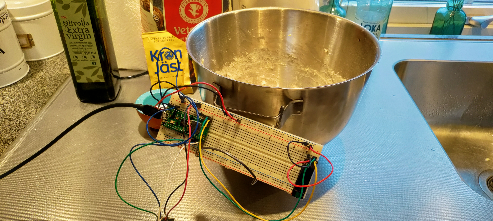

This is a tutorial on how to build a baking assistant where the user can see temperature and humidity, they can also tell the device how much yeast they used in their dough to get a recommended proofing time. 

The temperature and humidity is monitored by a DHT11 sensor and a rotary encoder is used to assign the yeast amount. An OLED screen will in real time present the temperature, humidity and yeast amount in grams with conversion for both fresh and dry yeast. The software will calculate a recommended proofing time and publish information to Adafruit through a MQTT protocol where the information is presented on a dashboard and the user is sent a message through discord.

The time to create this project is probably around 8-12 hours depending on prior knowledge.

## Objective

I chose this project because I'm a hobby baker and throwing together a dough before sleep to let it proof overnight is great but I've noticed that it’s usually very inconsistent and I felt it could improve, also this felt like a reasonable project scope for me to learn IoT with.

The device is intended to assist a hobby baker with readings and recommendations helping them make better decisions around their bread proofing environment and hopefully help them stop over or under proofing their doughs. The device is clumsy and would need some further development especially some form of protection.

Note! This device will recommend a proofing time depending on temperature and the amount of yeast you use in grams. This is done for ease of use and currently assuming a standard around 400-600g flour. A more correct way would also require input for other ingredients like flour, water and salt to give a totally accurate reading.

## Materials

Materials used during the project:

| Component                                 | Description                            | Purchase Link                                                        | Price (SEK) |
|-------------------------------------------|----------------------------------------|----------------------------------------------------------------------|-----------|
|  | Raspberry Pi Pico WH                   | [Link](https://www.electrokit.com/raspberry-pi-pico-wh)                                  | 109   |
| 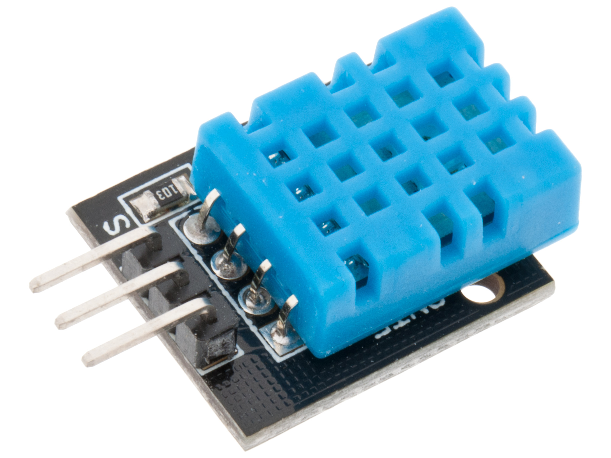   | DHT11 Temperature and Humidity Sensor   | [Link](https://www.electrokit.com/produkt/digital-temperatur-och-fuktsensor-dht11/)                              | 49  |
| 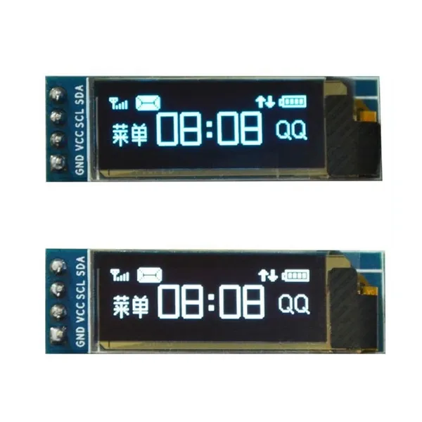  | OLED LDC Displat                           | [Link](https://www.wish.com/product/5b960ef5f1220016bb853780)                               | 26         |
| 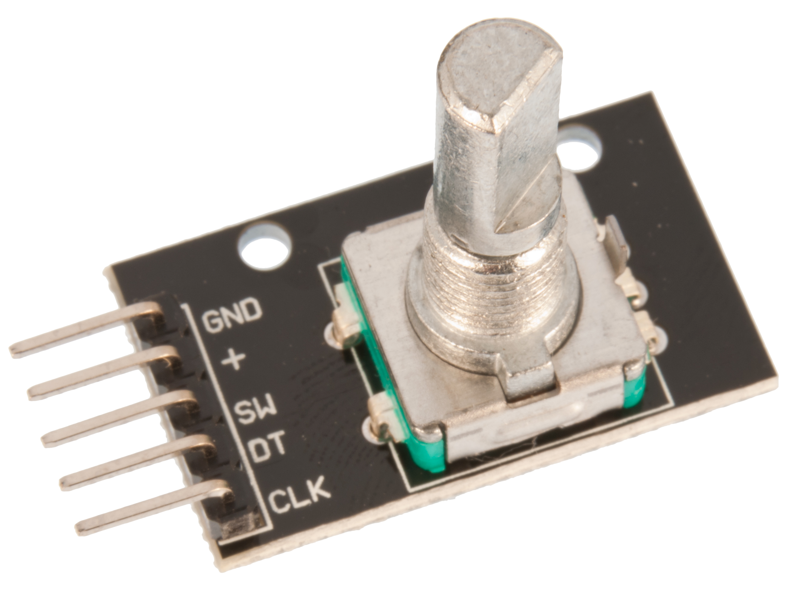    | Rotary Encoder   | [Link](https://www.az-delivery.de/en/products/drehimpulsgeber-modul)                                | 49         |
|     | Breadboard    | [Link](https://www.electrokit.com/kopplingsdack-840-anslutningar)                                | 69         |
|     | Jumper Wire Male to Male    | [Link](https://www.electrokit.com/labbsladd-20-pin-15cm-hane/hane)                                | 29         |
| 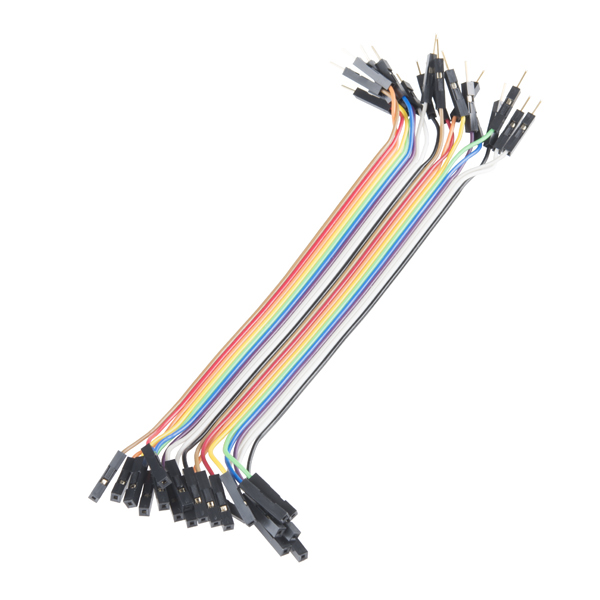    | Jumper Wire Male to Female    | [Link](https://www.electrokit.com/labbsladd-20-pin-15cm-hona/hane)                                | 29         |
|     | USB-cable  Male to Female    | [Link](https://www.electrokit.com/usb-kabel-a-hane-micro-b-5p-hane-1.8m)                                | 39         |
| 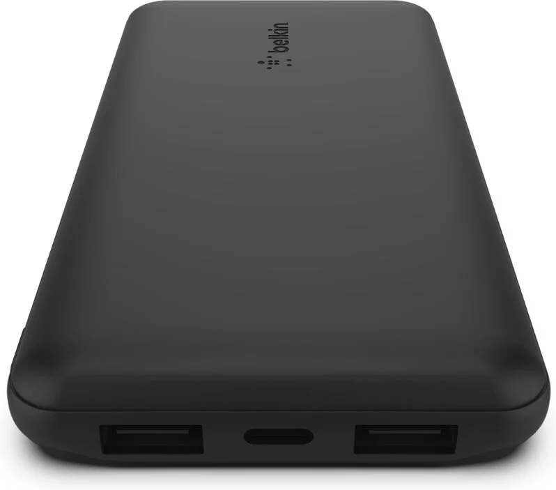    | Powerbank    | [Link](https://www.webhallen.com/se/product/339699-Belkin-BoostCharge-10-000mAh-Powerbank-2-x-USB-A-1-x-USB-C-Svart)                                | 199         |

You don't necessarily need a power bank, this is to power the device while it is in the kitchen.

## Computer Setup

 ### 1. Flash the Raspberry Pi Pico WH.
   - Make sure your Raspberry Pi Pico WH is not connected to your computer.
   - Download the MicroPython firmware (.uf2 file) for Raspberry Pi Pico from !!LINK.
   - Hold down the BOOTSEL button on your Raspberry Pi Pico WH.
   - While holding BOOTSEL, connect the Pico Wh to your computer with a USB cable.
   - The Raspberry Pi Pico WH will appear as a storage device on your computer.
   - Place the firmware you downloaded (.uf2 file) in the Raspberry Pi Pico WH .
   - The device should disconnect and not reappear as a storage device.

 ### 2. Install IDE and Extensions.
   - Install [Node.js](https://nodejs.org/en/download/package-manager/current)
   - Install [VScode](https://code.visualstudio.com/download)
   - Start VScode to the extensions tab on the left hand bar and search for Pymakr, install it.
   - The Pymakr extension should now be on the left bar, go to it and click on create project.
   - 
     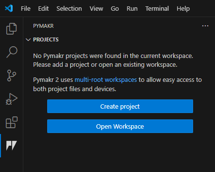
     
   - Create a folder (you can name it whatever) and click use this folder.
   - A window will ask for a project name (you can name it whatever you want).
   - Go to the Explorer tab on the left hand bar, click “open folder” and select your project folder.
   - Go back to the Pymakr extension, click on “add devices”, and select your device .
   - You are now ready to begin!.

 ### 3. Download Necessary Drivers.
   - You will need 3 drivers to properly use the Rotary encoder and OLED. As they are not built-in with Micropyton. 
   - Inside your project folder create a folder named exactly “lib”. 
   - Download [rotary_irq_rp2.py](https://github.com/miketeachman/micropython-rotary/blob/master/rotary_irq_rp2.py)
   - Download [rotary.py](https://github.com/miketeachman/micropython-rotary/blob/master/rotary.py)
   - Download [ssd1306.py](https://github.com/stlehmann/micropython-ssd1306/blob/master/ssd1306.py)
   - Place the downloaded files in the lib folder.
   - You now have all the prerequisite steps and can start assembly!


## Putting Everything Together

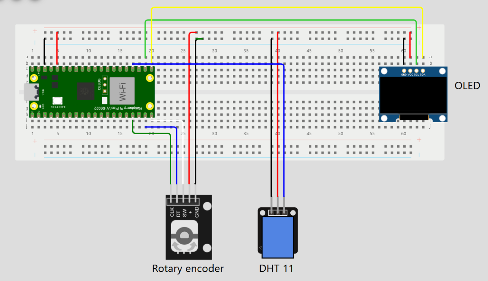

The DHT11 sensor is extended with M2F cables so it can be placed inside the proofing bowl while the rest of the device is outside protecting it form the damp and away form the dough that could damage it.
Rotary encoder extended with M2F cables due to the pins direction pointing the rotary towards the board and making it akward to use. You can arrange components however you want aslong as thet are correctly wired.

## Platform

I decided to use [Adafruit IO](https://io.adafruit.com/), it’s a free and simple cloud service. The reason for choosing it was that I wanted to send myself the recommended proof time and I noticed that sending a webhook message through Adafruit was a feature, it also seemed to have quite a simple but easy to use statistical presentation. To learn more about Adafruit set-up
you can press [here](https://learn.adafruit.com/adafruit-io-basics-feeds).

In hindsight I would have liked to try Ubidots instead as while it looks a bit more complex it also seems to have better customisation, something I felt Adafruit was lacking as I could not get my dashboard to look especially appealing. In future I might move to Ubidots but I would have to change my current MQTT based protocol to an API for data transfer.

## Code
### File Structure
- `boot.py` can be empty for this project
- `main.py` handles sensor readings, calculations and sends data.
- `mqtt.py` [MQTT library](https://github.com/MartinKarlsson1337/iot-bike/blob/main/lib/mqtt.py) used for the communication between devices.
- `wifiConnection` [Wi-Fi Connection](https://github.com/iot-lnu/pico-w/blob/main/network-examples/N2_WiFi_MQTT_Webhook_Adafruit/lib/wifiConnection.py) connects to Wi-Fi.
- `keys.py` manages credantials and feed information
  
- `lib folder` containing:
  - `rotary_irq_rp2.py` driver helping reading the rotary encoder.
  - `rotary.py` main rotary driver
  - `ssd1306.py` driver for controling the OLED display

### Imports
```
import time                   # Allows use of time.sleep() for delays
from mqtt import MQTTClient   # For use of MQTT protocol to talk to Adafruit IO
import machine                # Interfaces with hardware components
from machine import Pin       # Define pin
import keys                   # Contain all keys used here
import wifiConnection         # Contains functions to connect/disconnect from WiFi 
from rotary_irq_rp2 import RotaryIRQ # Import Rotary functions
from machine import I2C, Pin         # Import information from I2C Pin
from ssd1306 import SSD1306_I2C      # Import Screen functionalities
import dht                           # Import Thermometer and Humidity sensor funcions

```
 ### The Main Code
```
# Establish connection for LED, Temp sensor and Rotary encoder
i2c = I2C(0,sda=Pin(16), scl=Pin(17))
display = SSD1306_I2C(128, 32, i2c)
tempSensor = dht.DHT11(machine.Pin(18))

# Set values for rotary encoder
r = RotaryIRQ(pin_num_clk=13,
              pin_num_dt=14,
              min_val=5, # Min value needs to be > 0 to never divide by 0 in calc
              max_val=50,
              incr=5,
              reverse=False,
              range_mode=RotaryIRQ.RANGE_BOUNDED
              )

```
Here we establish our connection with the connected devices though reading the specific pins data throughput. The rotary had to be set to specific values, the most important for later calculations is that the minimum value could not be 0 as I will use this value later in a division. Originally the minimum value and increment was 1, the problem was that it took far too much time to rotate the device before hitting max. The solution was to increase increments to 5 and the minimum value was also set to 5.

The max value was set to 50 as a standard yeast cube is 50 grams and I personally never bake batches larger than one yeast cube. It should be noted that the way later calculations are done, increasing the max value beyond 50 would break how it works and a new way of calculating would need to be developed.


```
def temp_time (temprature_min):
    if temprature_min < 0:
        value = 1
    elif 0 <= temprature_min < 8:
        value = 640
    elif 8 <= temprature_min < 14:
        value = 480
    elif 14 <= temprature_min < 20:
        value = 120
    elif 20 <= temprature_min < 30:
        value = 60
    else:
        value = 60
    return value

current_temp = temprature
# current_temp = 2
adjusted_val = temp_time(current_temp)
```
This code checks the temperature and assigns a value depending on where it is sorted, this value is an approximate prooting time ignoring the amount of yeast the dough actually contains.

This is the least elegant part of the code, one can imagine a better system where you use a logarithmic scale to properly establish proofing times and get a time perfect for all temperatures instead of grouping them together. But I am neither a professional baker or a proficient mathematician so this is my crude solution.

```
def calculate(T, Y):
    Y = Y / 100  # Divide rotary encoder value lowest is 1 highest is 50 so make it into decimals for easier calcs
    calc_min  = T / (Y * 2)   # The formula T / (Y / 100 * 2) to calc minutes
    calc_result = calc_min / 60 # convert to hours
    return round(calc_result)

T = adjusted_val # The time based on temperature
Y = r.value() # The rotary encoder value for setting yeast ammount
calc_result = calculate(T, Y)
```
Here is the calculation that recalculates the temperature recommended time to include the yeast value, I was unable to find a good source that has a formula containing temperature, time and yeast percentage and had to figure one out by myself, in the end i made this simple formula:

```
Y = Yeast value selected by user
T = Recommended time from the earlier function
R = Recommended time with yeast considered in minutes

Y/100
T/(Yx2) = R
R/60
```
R is divided by 60 to convert minutes to hours.
T is originally set as a appropriate time for a fully yeasted dough.
Y is a value between 5-50 we divide it to make the value into a decimal.
Y is multiplied by 2 so that we have a range between 0.1 and 100.

This gives us a function that increases the recommended time if yeast is lower 
Or keeps it the same if you use 50g

```
def update_display(r, display):
    temp_val,humidity_val = read_temp() #Get temperature and humidity from sensor
    display.fill(0)
    rot_val = r.value()
    dry_val = round(rot_val / 4.2) # simple yeast cube to dry yeast conversion(yeast cube expected in calcs this is only for user conveniance)
    display.text("Temp {}C H {}%" .format(temp_val, humidity_val) , 2, 8) # Display on the screen, first row
    display.text("Cube {}g Dry {}g" .format(rot_val, dry_val) , 2, 20) # Display on the screen, secound row
    display.show()  # Refresh the display

update_display(r, display)
```
Function displays all information on the OLED its quite standard calling other functions to get new information displaying that information and updating. 

I decided to make a last minute edition that who the conversion rate between fresh yeast and dry yeast so if you're baking with dry yeast you don't have to do any math a fresh cube weights 50g and a packet of dry 12g 50/12 is around 4.2, 50/4.2 is going to create a lot of decimals och i used the round function to keep it to whole numbers.

```
    while 1:              # Repeat this loop forever

        if time.time() % 20 == 0:  # A separate timer to send data as to not get throtteled 
            send_values()     # Sen values in loop

        calc_result = calculate(T, Y) # 
        Y = r.value() #Update the Rotary value 
        update_display(r, display) # Update display in loop
        client.check_msg() # Action a message if one is received. Non-blocking.
        time.sleep(1) # Timer for loop kept low so as to not particurally affect rotary feel
```
The main loop calling all functions, a problem in the early development was that the rotary encoder was in conflict with the sending of values as a rotary encoder wants to update regularly while sending data to regularly would throttle my Adafruit services. 

In the end I figured out a way to create a separate timer for the data publishing while keeping the rest of the loop going. In further development I would probably change this away from a constant loop, and set a trigger (like pressing the encoder button) and a timer to keep it active during the proofing.

### Full Code

The full code and files can be found in this repository

## Transmitting Data, Connectivity

Data transmission is through Wi-Fii using MQTT protocol, the data is sent to Adafruit every 20 seconds while the device is on. 20 seconds felt like an appropriate timer for accurate data while not throttling data due to having too many data points.

Adafruit has 2 actions to send a webhook message to a discord server. It will send a message every 30 minutes if the values have changed, this is to ensure that if the climate has changed for instance if you place your proofing bowl in the fridge it will recommend a new time.

Wi-Fi felt like the correct choice since i had no real use case outside of my home kitchen and as Wi-Fi is readily available it came with no extra cost.
LoRaWAN could be interesting to use as it requires less power and a much further range it could allow for some outdoor usage in perhaps a camping/mobile home scenario if the device was protected in a case. Another problem with LoRaWAn is that I am to far away from a gateway I could have subscribed to Helium but it felt like above and beyond what i required and i decided against it.

## Presenting Data
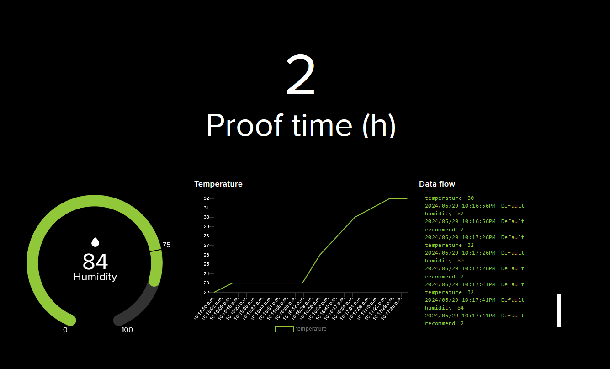

The temperature and humidity data from the DHT11 is displayed on an OLED screen together with the user's selected yeast amount. This data is updated every 1 second. This loop felt like a good middle point where it didn't feel unnecessarily fast while still working well with using the rotary encoder to choose a yeast value.
The data is published to Adafruit and saved every 20 seconds while the device is powered, each feed stores data for 30 days. The feeds supply a line graph, a gauge, an info stream and a regular text box to present the user with data. Adafruit salso sends 2 messages through webhooks to discord.


<p align="center">
  
  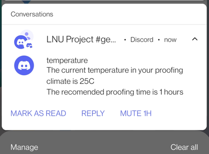
</p>


## Finalizing The Design

This was my first foray into IoT, and I consider this project more of a learning tool rather than something I'm going to use daily, but it was fun to work with a topic I enjoy. I have created something that, with more work, could be genuinely useful. I've gained a lot of knowledge around circuitry and this was my first time using python which i've come to appreciate (atleast over java). 

The major upgrades i would do in the future is:
 - Create a start button so that the sequence only starts on a click from the encoder .
 - Place the device in some case to protect it from the elements.
 - Change cloud service to something that allows for more UI customization.
 - The set of calulations to get a recomended proof time would be changed so it can handle different scales.

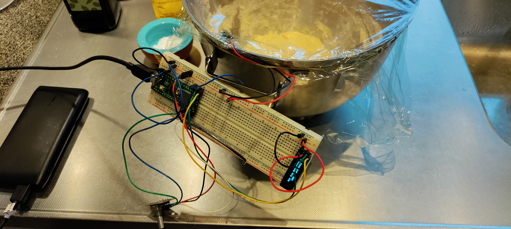


