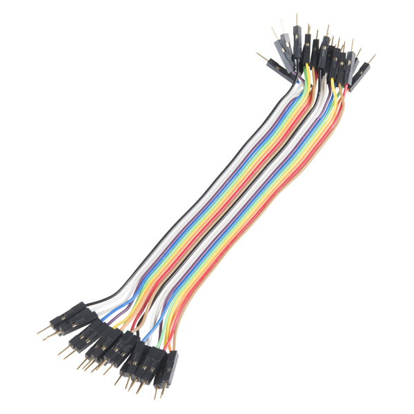

Gustav Helgesson Liljedal gh222nq

# IoT_project
IoT_project

This is a tutorial on how to build a baking assistant where the user can see temperature and humidity, they can also tell the device how much yeast they used in their dough to get a recommended proofing time. The temperature and humidity is monitored by a DHT11 sensor and a rotary encoder is used to assign the yeast amount. An OLED screen will in real time present the temperature, humidity and yeast amount in grams with conversion for both fresh and dry yeast. The software will calculate a recommended proofing time and publish information to Adafruit through a MQTT protocol where the information is presented on a dashboard and the user is sent a message through discord.

The time to create this project is probably around 8-12 hours depending on prior knowledge

## Objective


I chose this project because I am a hobby baker and throwing together a dough before sleep to let it proof overnight is great but I've noticed that it’s usually very inconsistent and I felt it could improve and this felt like a reasonable project scope for me to learn IoT with.

The device is intended to assist a hobby baker with readings and recommendations helping them make better decisions around their bread proofing environment and hopefully help them stop over or under proofing their doughs. The device is clumsy and would need some further development especially some form of protection 


## Materials

Materials used during the project:

| Component                                 | Description                            | Purchase Link                                                        | Price (SEK) |
|-------------------------------------------|----------------------------------------|----------------------------------------------------------------------|-----------|
|  | Raspberry Pi Pico WH                   | [Link](https://www.electrokit.com/raspberry-pi-pico-wh)                                  | 109   |
|    | DHT11 Temperature and Humidity Sensor   | [Link](https://www.electrokit.com/produkt/digital-temperatur-och-fuktsensor-dht11/)                              | 49  |
|   | OLED LDC Displat                           | [Link](https://www.wish.com/product/5b960ef5f1220016bb853780)                               | 26         |
|     | Rotary Encoder   | [Link](https://www.az-delivery.de/en/products/drehimpulsgeber-modul)                                | 49         |
|     | Breadboard    | [Link](https://www.electrokit.com/kopplingsdack-840-anslutningar)                                | 69         |
|     | Jumper Wire Male to Male    | [Link](https://www.electrokit.com/labbsladd-20-pin-15cm-hane/hane)                                | 29         |
|     | Jumper Wire Male to Female    | [Link](https://www.electrokit.com/labbsladd-20-pin-15cm-hona/hane)                                | 29         |
|     | USB-cable  Male to Female    | [Link](https://www.electrokit.com/usb-kabel-a-hane-micro-b-5p-hane-1.8m)                                | 39         |

## Computer Setup


1. ### Flash the Raspberry Pi Pico WH.
   - Make sure your Raspberry Pi Pico WH is not connected to your computer.
   - Download the MicroPython firmware (.uf2 file) for Raspberry Pi Pico from !!LINK.
   - Hold down the BOOTSEL button on your Raspberry Pi Pico WH.
   - While holding BOOTSEL, connect the Pico Wh to your computer with a USB cable.
   - The Raspberry Pi Pico WH will appear as a storage device on your computer.
   - Place the firmware you downloaded (.uf2 file) in the Raspberry Pi Pico WH .
   - The device should disconnect and not reappear as a storage device.

2. ### Install IDE and Extensions.
   - Install VScode !!LINK.
   - Install Node.js !!LINK.
   - Start VScode to the extensions tab on the left hand bar and search for Pymakr, install it.
   - The Pymakr extension should now be on the left bar, go to it and click on create project.
   - Create a folder (you can name it whatever) and click use this folder.
   - A window will ask for a project name (you can name it whatever you want).
   - Go to the Explorer tab on the left hand bar, click “open folder” and select your project folder.
   - Go back to the Pymakr extension, click on “add devices”, and select your device .
   - You are now ready to begin!.


2. ### Download necessary Drivers.
   - You will need 3 drivers to properly use the Rotary encoder and OLED. 
   - Inside your project folder create a folder named exactly “lib”. 
   - Download [rotary_irq_rp2.py](https://github.com/MartinKarlsson1337/iot-bike/blob/main/lib/mqtt.py)
   - Download rotary.py !!LINK
   - Download ssd1306.py !!LINK
   - Place the downloaded files in the lib folder.
   - You now have all the prerequisite steps and can start assembly!


## C
## Putting everything together

The DHT11 sensor is extended with M2F cables so it can be placed inside the proofing bowl while the rest of the device is outside protecting it form the damp and potential dough that could damage it

Rotary encoder extended with M2F cables due to the pins direction pointing the rotary towards the board and making it akward to use

## platform

## Code

- `boot.py` can be empty for this project
- `main.py` handles sensor readings, calculations and sends data.
- `mqtt.py` [MQTT library](https://github.com/MartinKarlsson1337/iot-bike/blob/main/lib/mqtt.py) used for the communication between devices.
- `wifiConnection` [Wi-Fi Connection](https://github.com/iot-lnu/pico-w/blob/main/network-examples/N2_WiFi_MQTT_Webhook_Adafruit/lib/wifiConnection.py) connects to Wi-Fi.
- `keys.py` manages credantials and feed information
  
- `lib folder` containing:
- - `rotary_irq_rp2.py` driver helping reading the rotary encoder.
- - `rotary.py` main rotary driver
- - `ssd1306.py` driver for controling the OLED display

```
def calculate(T, Y):
    Y = Y / 100  # Divide rotary encoder value lowest is 1 highest is 50 so make it into decimals for easier calcs
    calc_min  = T / (Y * 2)   # The formula T / (Y / 100 * 2) to calc minutes
    calc_result = calc_min / 60 # convert to hours
    return round(calc_result)

T = adjusted_val # The time based on temperature
Y = r.value() # The rotary encoder value for setting yeast ammount
calc_result = calculate(T, Y)
```
qweqwe
```
def update_display(r, display):
    temp_val,humidity_val = read_temp() #Get temperature and humidity from sensor
    display.fill(0)
    rot_val = r.value()
    dry_val = round(rot_val / 4.2) # simple yeast cube to dry yeast conversion(yeast cube expected in calcs this is only for user conveniance)
    display.text("Temp {}C H {}%" .format(temp_val, humidity_val) , 2, 8) # Display on the screen, first row
    display.text("Cube {}g Dry {}g" .format(rot_val, dry_val) , 2, 20) # Display on the screen, secound row
    display.show()  # Refresh the display

update_display(r, display)
```
qweqweqw

```
def temp_time (temprature_min):
    if temprature_min < 0:
        value = 1
    elif 0 <= temprature_min < 8:
        value = 640
    elif 8 <= temprature_min < 14:
        value = 480
    elif 14 <= temprature_min < 20:
        value = 120
    elif 20 <= temprature_min < 30:
        value = 60
    else:
        value = 60
    return value

current_temp = temprature
# current_temp = 2
adjusted_val = temp_time(current_temp)
```
qweqwe

# Display function show selected yeast and temp/humid

## Transmitting data/connectivity

Wifi over lorawan
I decided to use wifi since i had no real usecase outide of my home kitchen and as wifi is readely avalible 
lorawan could be interesting to use as it requires less power and a much further range it could allow for some outdoor usage in perhaps a camping/mobile home senario if the device was protected in a case.

## Presenting data

## Finalizing the design
